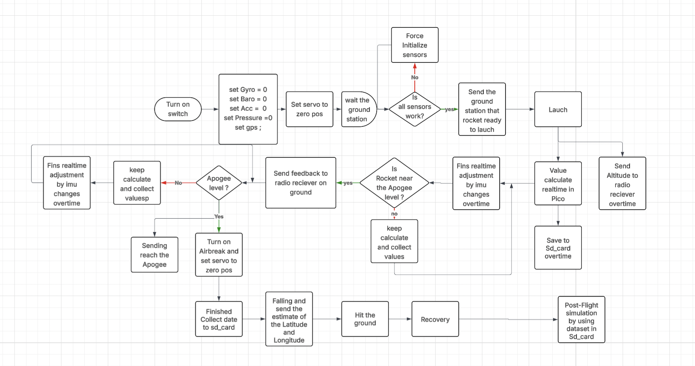

# ARCs Team 9 : ICARIAN APOGEE


## Introduction of our group : 
Our team decide to participate in ssi-society to develop a rocket that can reach the stratosphere and beyond. We are a group of passionate engineers student that are dedicated our hobby time to develop technologies and contribute to how to design rockeet in real world situation. We are not aim to make it fastest or most efficient rocket but we are aim to make it more reliable and safe rocket. However, the main motivation that always drive us to aganist the competition is to learn and having time during the competition as much as possible.

## Roadmap & Workflow

<p align="center">
  
</p>


## Pin GPIO :


### Pin register by :

1. **I2C0 — For IMU + Barometer**
   * SDA → GPIO 2
   * SCL → GPIO 3


2. **UART1 — For GPS**
   * GPS TX → GPIO 1
   * GPS RX → GPIO 2

3. **SPI0 — For LoRa SX1278**
   * SCK → GPIO 18
   * MOSI → GPIO 19
   * MISO → GPIO 16
   * CS → GPIO 17
   * DIO0 → GPIO 20

4. **SPI1 — For SD Card**
   * SCK → GPIO 10
   * MOSI → GPIO 11
   * MISO → GPIO 12
   * CS → GPIO 13

5. **Power**
   * All sensors (except GPS) → 3.3V
   * GPS → 5V
   * All grounds → GND

--- 


### Github workflow :

**Commit code**
```bash
    cd SSI_ROCKETRY
    git add .
    git commit -m "Your comments"
```

So what is commit files ? Ans: Commit files are the changes that you want to save in your repository. When you commit your changes, you are saving a snapshot of your project at that moment in time. This allows you to track changes over time and revert to previous versions if needed.


**Commit gitignore:**
```bash
    git add .gitignore
    git commit -m "update gitignore"
```

So what is gitignore ? Ans: Gitignore is a file that tells git which files to ignore when committing changes. It is used to exclude files that are not relevant to the project, such as temporary files or build artifacts.

**Branch repository**
```bash
    git branch <branch_name>
    git checkout <branch_name>
```

So what is branch repository ? Ans: Branch repository is a feature of git that allows you to create a separate line of development within your repository. This is useful when you want to work on a new feature or fix a bug without affecting the main codebase.

**Merge branch**
```bash
    git merge <branch_name>
```

So what is merge branch ? Ans: Merge branch is a feature of git that allows you to combine changes from one branch into another. This is useful when you want to integrate changes from a feature branch into the main codebase.

**pull request**
```bash
    git pull <remote_name> <branch_name>
```
So what is pull request ? Ans: Pull request is a feature of git that allows you to request changes from one branch into another. This is useful when you want to integrate changes from a feature branch into the main codebase.

**push**
```bash
    git push <remote_name> <branch_name>
```
So what is push ? Ans: Push is a feature of git that allows you to upload changes from your local repository to a remote repository. This is useful when you want to share your changes with others or back them up.

**Update First month of the year progress**

Our team Avionic did a plenty of work by I have to start with sensor and innovation progress
IMU one of our team focus on the most for a long time to trying to minimise risk of pointing wrong direction to the rocket so out first exercution was used raw output from imu itself but the thing is when we used raw data we were lost of a millisec data for instance rocket turn 1 - 5 degree in 5 second so it was supposed to show the real value in each of sec like propery one but instead of that it was shown a fractuate of swing in term of output so that why we integrate a mathimatic equation like kalman filter into an our algorithm


### **Avionic team member :**

   1. Ninrapat (Overall-code-management)
   2. Rohan    (Avionic lead)
   3. Ahmed    (Power and Design) 
   4. Kene     (Electric and Design)
   5. Saleh    (Simulation post flight)
   
   